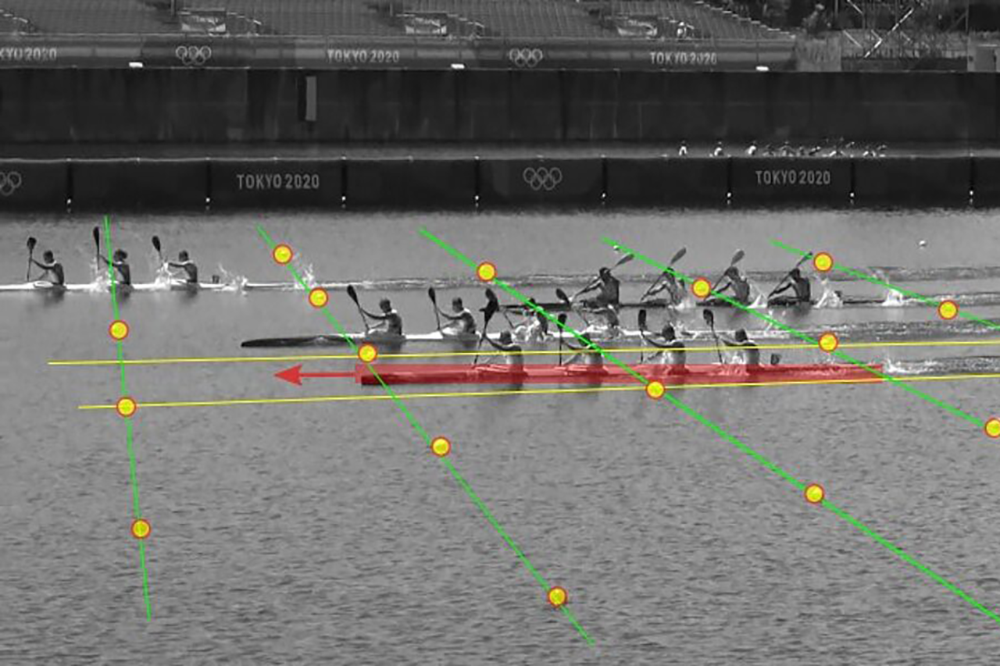
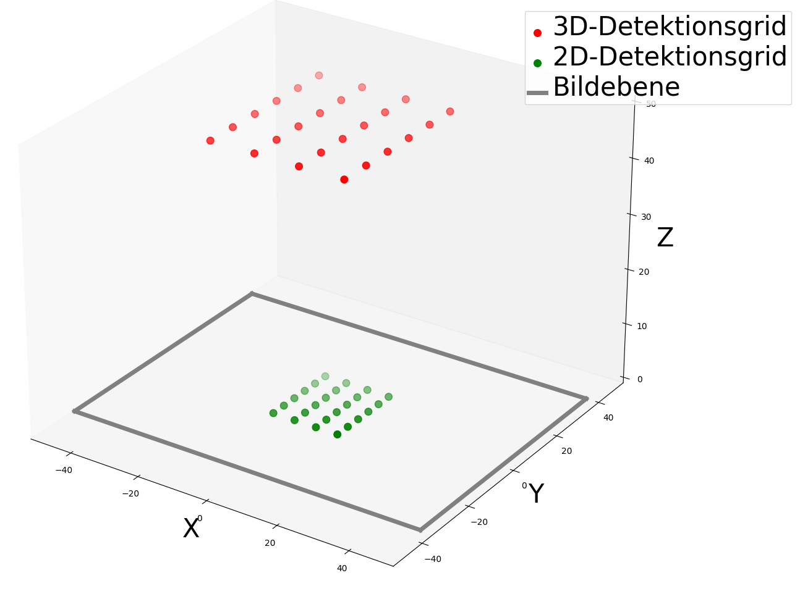
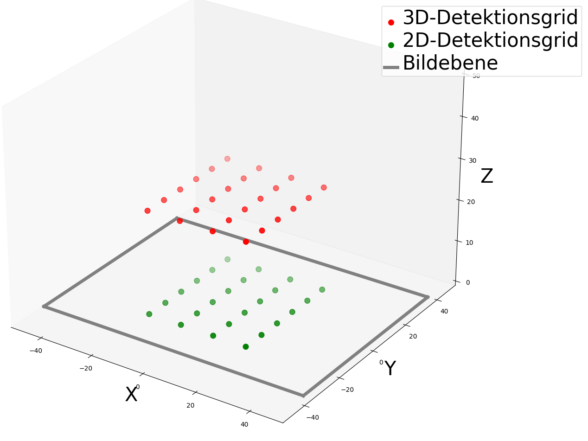
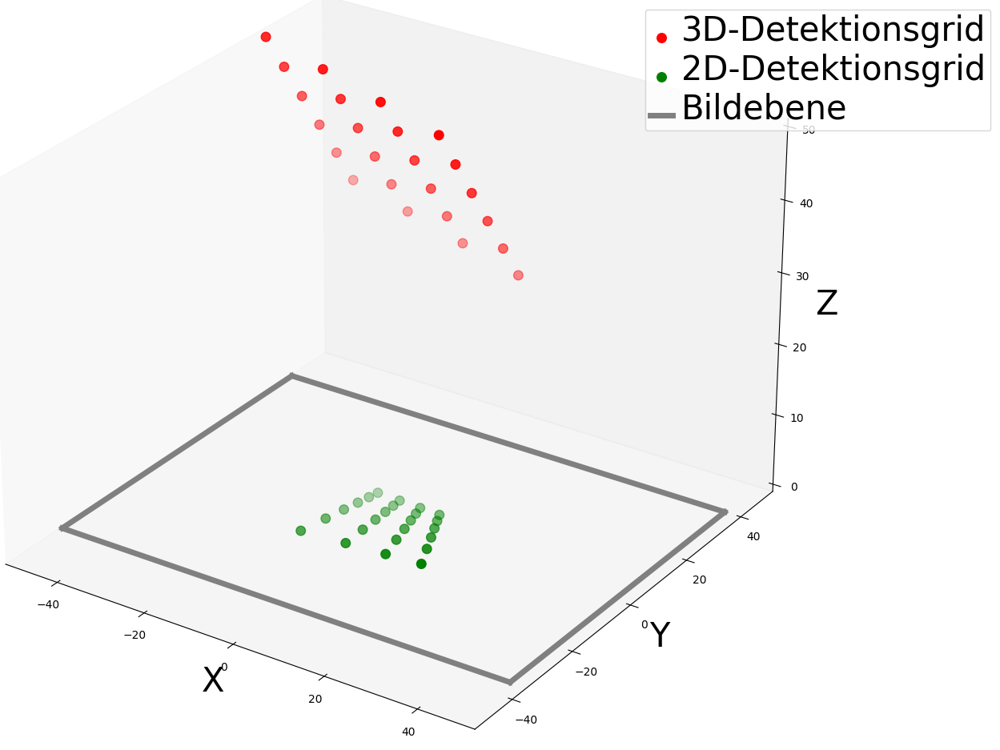
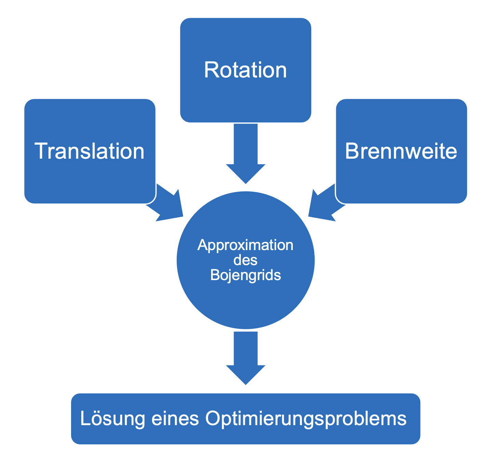
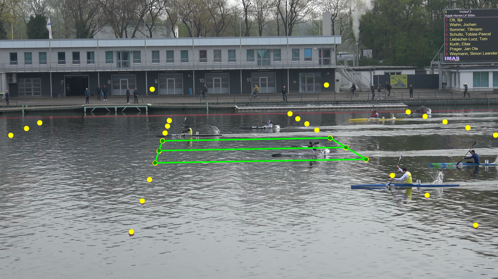
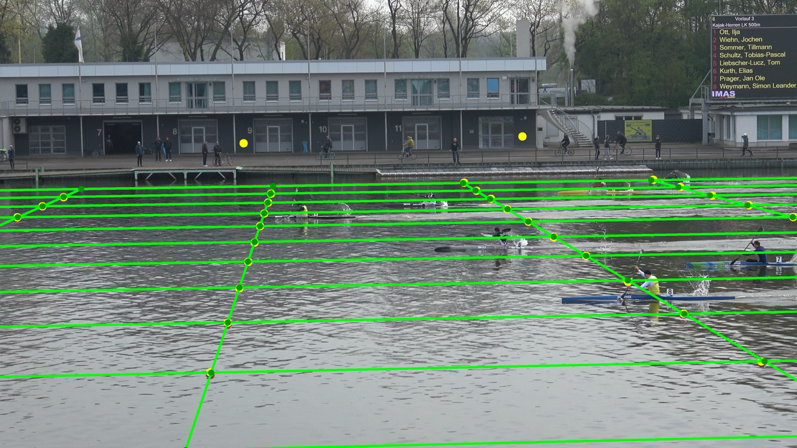
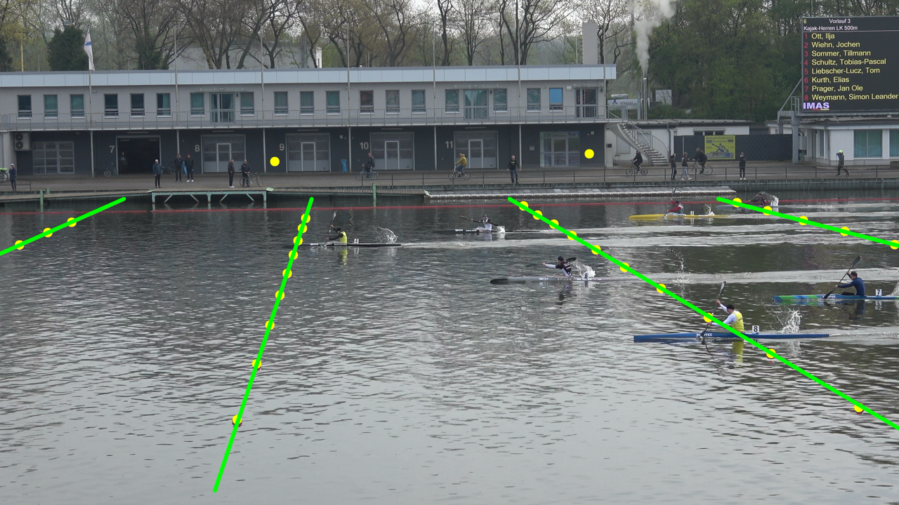

# Boat Speed Estimation from Grid-Based Buoy Locations
## How it works
| Detected Grid                   | Detected Lines                        | 
|---------------------------------|---------------------------------------|
|  |  | 

**Left:** The detected grid.  
**Right:** The detected lines (green) are extracted based on the grid detection. The red lines represent manually set labels, which are required for metrics.

## Goal
The objective of this project is to determine the speed of a single boat based on the grid-based location of buoys. We leverage spatio-temporal scene geometry for this task. Boats are arranged in a grid from a bird’s-eye view, and perpendicular lines along the buoys are detected to provide a reference distance. The time required to traverse this distance allows for speed estimation. The coordinates of the buoys are predefined.

*(Source: [HTWK Leipzig](https://ing-ebit.htwk-leipzig.de/forschung/canoe-raice))*  

## Challenges
- **Camera Positioning**: The recording is taken from the spectator stand beside the race, causing spatial distortion due to the perspective of the captured image.
- **Non-Static Camera**: The camera moves from right to left, making line detection challenging.
- **Noisy Environment**: Variability in conditions affects detection accuracy.

## Methodology
1. **3D Grid Projection**: A **red** 3D grid is created and projected onto the **green** 2D image plane using the pinhole camera model. By varying the 3D grid, the resulting projection on the 2D image plane also changes.

| Projection 1                         | Projection 2                         | Projection 3                         |
|--------------------------------------|--------------------------------------|--------------------------------------|
|  |  |  |

2. **Optimization**: An optimization problem is solved to align the 2D detection grid with the known buoy coordinates.

   

3. **Parameter Estimation**: The solution yields seven parameters:
   - **3 translation parameters**
   - **3 rotation parameters**
   - **1 focal length parameter**
4. **Grid Extension**: Using the obtained parameters, the detection grid is extended, allowing easy extraction of reference lines for speed estimation.

## Results
| Detection Grid                       | Extended Detection Grid               | Detected Lines                        |
|--------------------------------------|---------------------------------------|---------------------------------------|
|  |  |  |

